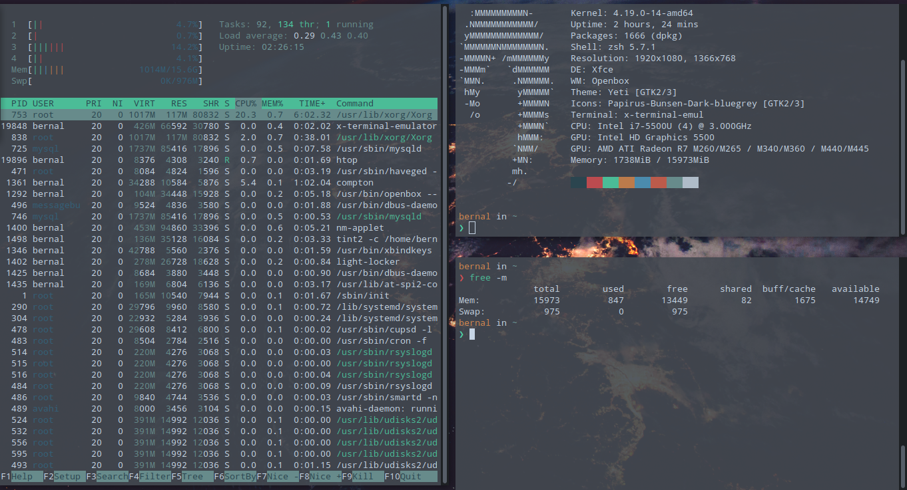
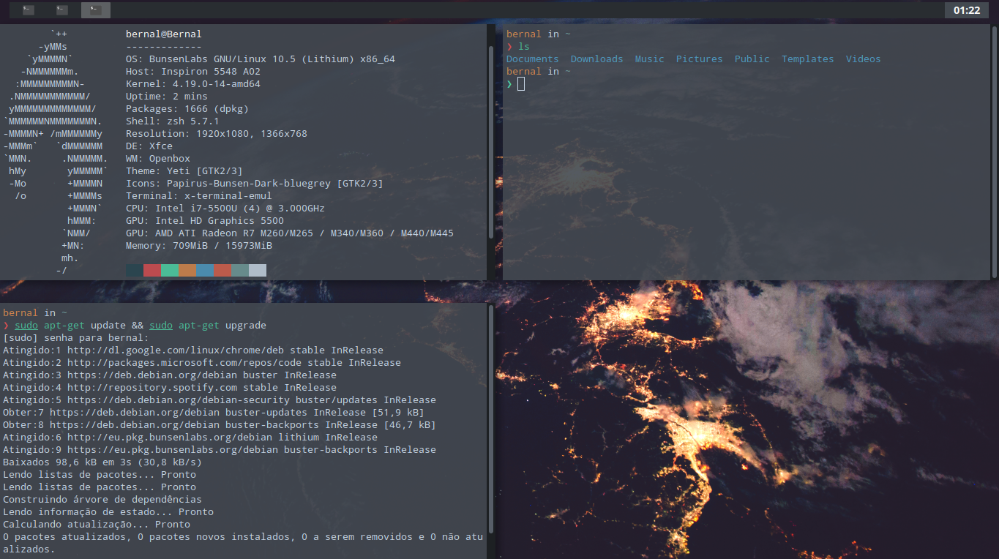
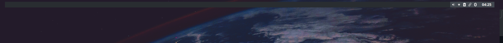
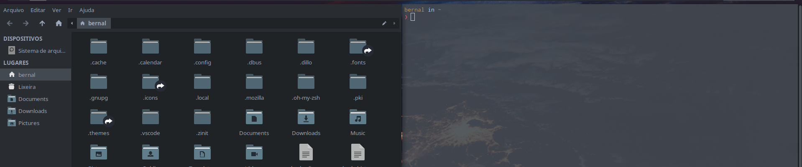

<h1>INTRODUÇÃO</h1>

  Guia simplificado de configuração e customização do meu OpenBox (Bunsenlabs)
  Não sou especialista em Linux e sim um apaixonado que gosta de brincar, testar
  e aprender, portanto, provavelmente este guia terá alguns erros, nada que o
  nosso amigo Google não resolva. Aceito sugestões e dicas para melhorar o meu
  ambiente, lembrando que essas são as minhas configurações, fiz para o meu uso,
  fique a vontade para fazer mudanças em seu sistema estou apenas compartilhando
  os meus conhecimentos

  Depois de muitas tentativas com XFCE GNOME LXDE KDE I3WM enfim consegui
  encontrar o meu sistema e configuração perfeito, que melhor se adapta ao meu
  "estilo" (olha que demorou muito haha). A ideia inicial é um sistema leve
  rápido com aparência minimalista e grande produtividade, conseguindo tudo sem
  tirar as mãos do teclado.

<h5>
  <b>DICAS:</b> Já realizei essa config em um Debian minimal instalando o
  OpenBox do zero, Display Manager (etc etc) porém exige muito tempo para
  conseguir arquitetar todo o sistema (muitas quebras) então recomendo utilizar
  o Bunsenlabs , ele já vem com uma base bem solida até mesmo para quem está
  começando no mundos das customizações, é muito importante ler as documentações
  antes de qualquer mudança.
</h5>

<h1>O que vamos fazer ?</h1>

  Nesse guia deixo tudo mastigado, como configuração e personalização do painel,
  Wallpaper editado por mim, instalar e personalizar o ZSH (se você é
  desenvolvedor vai curtir), atalhos keyboard para melhorar a produtividade,
  ajustes de menu e janelas entre outros. Vamos utilizar o máximo de recurso
  possível que o Bunsenlabs nos entrega como tema GTK, Icones e Fonts, assim
  deixando o sistema mais leve (até porque o tema Yeti é Lindo). Basta ler os
  passos a seguir.

<h1>Referencias e Links</h1>

<b>Bunsenlabs:</b>https://www.bunsenlabs.org/

<b>OpenBox:</b>http://openbox.org/wiki/Main_Page

<b>OhMyZSH:</b>https://ohmyz.sh/

<b>Forum:</b>https://www.vivaolinux.com.br/comunidade/OpenBox/forum/

<h1>DIRETORIOS</h1>

<b>[.xbindkeysrc]</b>

home/.xbindkeysrc

<b>[autostart]</b>

/home/bernal/.config/bunsen/autostart

<b>[bl-rc.xml]</b>

/home/bernal/.config/openbox/bl-rc.xml

<b>[prepend.csv]</b>

/home/bernal/.config/jgmenu/prepend.csv

<b>[.zshrc]</b>

/home

<h1>ZSH - INSTALAÇÃO E COSTUMIZAÇAO</h1>

<h4>ZSH - Instalação e Costumização</h4>

1. sudo apt install zsh

  2. sh -c "$(curl -fsSL
  https://raw.githubusercontent.com/ohmyzsh/ohmyzsh/master/tools/install.sh)"

  3.sh -c "$(curl -fsSL
  https://raw.githubusercontent.com/zdharma/zinit/master/doc/install.sh)" OBS:
  quando rodar o item 3 vai perguntar se você quer ou não instalar os plugins
  recomendados, excolher opção N (NÃO)

  4. git clone https://github.com/denysdovhan/spaceship-prompt.git
  "$ZSH_CUSTOM/themes/spaceship-prompt" --depth=1

  5. ln -s "$ZSH_CUSTOM/themes/spaceship-prompt/spaceship.zsh-theme"
  "$ZSH_CUSTOM/themes/spaceship.zsh-theme"

  6.Plugins (zsh-autosuggestions & zsh-syntax-highlighting) git clone
  https://github.com/zsh-users/zsh-autosuggestions.git
  $ZSH_CUSTOM/plugins/zsh-autosuggestions git clone
  https://github.com/zsh-users/zsh-syntax-highlighting.git
  $ZSH_CUSTOM/plugins/zsh-syntax-highlighting

7. copiar e colocar script .zshrc ( diretorio a cima)

<h1>PROGRAMAS E UTILITÁRIOS</h1>

<b>Git - instalação</b>
sudo apt install git

<b>NVM - instalação</b>
curl -o- https://raw.githubusercontent.com/nvm-sh/nvm/v0.37.0/install.sh |
$SHELL nvm install --lts

<b>YARN - instalação</b>
npm install --global yarn

<b>Gimp - Instalação</b>
sudo apt install gimp

<h1>Screenshot</h1>

<h4>Desktop e Wallpaper</h4>

<h4>Desempenho</h4>

<h4>Terminal e ZSH</h4>

<h4>Painel</h4>

<h4>Janelas (não utilizo a borda decorada então para fechar, minimizar e maximizar só pelo teclado ou terminal</h4>

<h1>Atalhos Keyboard</h1>

<h2>*Janelas</h2>

<b>Fechar Janela</b> WIN + 1

<b>Maximizar Janela</b> WIN + 2

<b>Fechar Minimizar</b> WIN + 3

  <b>Mover janela </b> WIN + cima ou WIN + baixo ou WIN + direita ou WIN +
  esquerda

  <b>Mover janela Bloco</b> WIN + ALT + cima ou WIN + ALT + baixo ou WIN + ALT +
  direita ou WIN + ALT+ esquerda

<b>Mover janela com Mouse</b> ALT + rastar c/ Mouse

<h2>*Programas</h2>

<b>Web</b> WIN + W

<b>Bloco de notas</b> WIN + E

<b>Spotify</b> WIN + S

<b>Arquivos</b> WIN + F

<b>Terminal</b> WIN + T

<b>Gimp</b> WIN + G

<b>Controle de Áudio</b> WIN + V

<b>Visual Studio Code</b> WIN + C

<h2>*Desligar Hibernar Suspender Reiniciar</h2>

<b>Win + X</b>

<h2>*Menu</h2>

<b>Win</b>

<h5>Obrigado !</h5>

